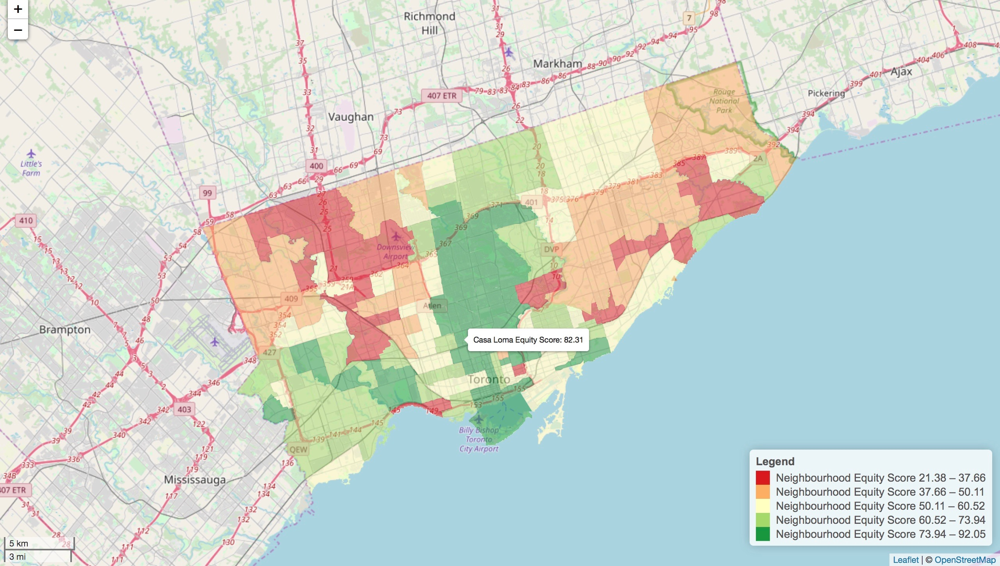

```{r setup, include=FALSE}
knitr::opts_chunk$set(echo = TRUE)
HELLO
```

## Introduction

This study seeks to compare a traditional GUI-based GIS (QGIS) and code-based GIS (R) – by creating two similar maps and comparing each workflow and output. This study will provide: the data and methodological workflow used for both GI Systems, the results of both GI Systems, a discussion on the benefits and drawbacks of each GI Systems conclude the findings of this study.


## Data and Methodology

The data used in this study was sourced from Toronto’s Open Data Initiative. This initiative follows a trend of public data becoming more accessible, creating a new GIS paradigm of sharing and reproducibility (Brunsdon and Singleton, 2015). This opening of government is a trend of big data which is helping researchers understand cities in more microscopic detail  (Arribas-Bel, 2014). A shapefile dividing Toronto into 140 different neighbourhood zones was used as the basis for choropleth mapping. Toronto’s Neighbourhood Equity Scores (NES) were then appended – these provide a score of social equity between 0-100 (100 being most socially equitable) and were formulated by the indicators listed in Table 1.

__Table 1 - Indicators udes to create Neighbourhood Equity Scores__

Economic      | Social           | Participation | Environmental      | Health
------------- | ---------------- | ------------- | ------------------ | ---------------
Unemployment  | Graduation       | Voter rates   | Community places   | Mortality
Low Income    | Marginalisation  |               | Walkability        | Mental health 
State support | Higher education |               | Health food access | Hospitalisation 
Content Cell  | Content Cell     |               | Green space        | Diabetes

Python’s pandas and geopandas packages were used to: clean, format and merge Toronto’s neighbourhood shapefile with the NES data. This was then exported for mapping in QGIS and R. Both GI Systems classified 5 Jenks quintiles based on the Toronto NES. QGIS then mapped these quintiles onto a web layer basemap of Toronto by creating a level of transparency of the NES layer. Whereas R plotted the same NES quintiles on an interactive leaflet map. This map object was then assigned a polygon overlay with hover functionality – the Neighbourhood name and NES is presented when a mouse is hovered over each polygon.

## Results

Figure 1 shows the NES map created in the GUI-based system. 


__Figure 1 -  GUI-based Map of Toronto Neighbourhood Equity Scores__


Figure 2.A shows the static map produced in R. 

__Figure 2.A - Code-based (static) Map of Toronto Neighbourhood Equity Scores__ 


In Figure 2.B the user can explore specific values by hovering a mouse over each polygon zone – this enables more region-specific measures of NES.


__Figure 2.B - Code-based (interactive) Map of Toronto Neighbourhood Equity Scores__ 
```{r leaflet, echo = FALSE, message = FALSE}
library(leaflet)
library(shinyjs)
library(plotly)
library(maptools)
library(RColorBrewer)
library(classInt)
library(OpenStreetMap)
library(sp)
library(rgeos)
library(tmap)
library(tmaptools)
library(sf)
library(rgdal)
library(geojsonio)
library(methods)
library(OpenStreetMap)

shp_link <- "/Users/GeorgePyne/Documents/CASA/GI Systems and Science/assignment_1/neighbourhoods_planning_areas_wgs84/Toronto_Equity.shp"
eqMapSF <-read_shape(shp_link, as.sf = TRUE) # Read the link to shapefile
breaks<-classIntervals(eqMapSF$EqScore, n=5, style="jenks") # Create 5 Jenks quintiles
breaks <- breaks$brks

eqMap <- eqMapSF %>%
  st_transform(crs = 4326) %>% #Transorm CRS for leaflet mapping
  as("Spatial")

pal <- colorBin(palette = "RdYlGn", # create color palette based on quintiles
                domain = eqMap$EqScore,
                bins = breaks)  #create bins from Jenks quintiles


map <- leaflet(eqMap) %>% # Make a leaflet object
  addPolygons(stroke = FALSE, 
              fillOpacity = 0.5, 
              smoothFactor = 0.5,
              color = ~pal(EqScore),
              label = ~paste(as.character(Neighbou_1),
                             " ",
                             "Equity Score: ", # Label adds user hover interface
                             as.character(EqScore)) 
              # paste command contatenates strings and add EqScores as strings
              
  ) %>%
  addProviderTiles("OpenStreetMap.Mapnik") %>% #import leaflet basemap
  addLegend("bottomright", 
            pal= pal, 
            values = ~EqScore, 
            title = "Legend", 
            labFormat = labelFormat(prefix = "Neighbourhood Equity Score "),
            opacity = 1)
  scaleBarOptions(maxWidth = 100, metric = TRUE, imperial = FALSE,
                updateWhenIdle = TRUE)
  addScaleBar(map, position = c("bottomleft"), # add scalebar to our leaflet object
              options = scaleBarOptions()) 

show(map)

```


## Discussion

Code-based GIS provides more reproducible research, this enables: results comparisons, documentation for methodologies and results to be updated (Brunsdon, 2016). This enables peer-to-peer GIS knowledge sharing. Harris (2016) highlights this enables users to: see the code behind the analysis, borrow or adapt existing code and to share their own code. Arribas-Bel (2014) coins this as ‘interdisciplinary glue’ – where there is even a cross pollination of methods from other fields. 

Code-based GIS has a steeper learning curve, it is not immediately clear what is being executed and it can be confusing as there are multiple ways of achieving the same objective (Harris, 2016). Brunsdon and Singleton (2015) argue a pragmatic problem of code-based GIS is it assumes users have adequate knowledge of programming and computational power.

Whilst the GUI-based GIS used in this study (QGIS) is an open-source software, the methods used aren’t easily documented. Documentation is advisable, otherwise the benefits of reproducibility and peer review are lost (Miller and Goodchild, 2015). GUI-based GIS is largely limited in mapping formats, but it is however adept at cartographic conventions (for example - the legend, scale bar and north arrow; see Figure 1). R however still provided a means of including a legend and interactive scale bar. The interactive hover tool and zoom function of Figure 2.A is a distinct advantage of code-based maps over GUI-based maps.

Harris et al. (2017) have monitored thehistory of both GUI and code-based GIS and concluded that two major limitations have remained. These are: (i) the ecological fallacy - when results from statistical analysis at one level of analysis are wrongly assumed to apply to another (Tranmer and Steel, 1998); and (ii) modifiable areal unit problem - a change in statistical results with an alteration of the scale of areal units or the aggregation criterion (Arbia and Petrarca, 2011). 


## Conclusion

Brunsdon and Singleton (2015) argue that currently code and GUI-based GIS are generally interchangeable which will likely continue - however the traditional user base of GUI-based GIS will be affected as open-source code matures. This study generally echoed this viewpoint, but critically it only provided two similar maps. Further research is suggested to compare the two systems using more advanced spatial analysis techniques.


## References

Arbia, Giuseppe, and Francesca Petrarca. "Effects of MAUP on spatial econometric models." _Letters in Spatial and Resource Sciences_ 4.3 (2011): pp.173-185.

Arribas-Bel, D., 2014. Accidental, open and everywhere: Emerging data sources for the understanding of cities. _Applied Geography_, 49, pp.45-53.

Brunsdon, C., 2016. Quantitative methods I: Reproducible research and quantitative geography. _Progress in Human Geography_, 40(5), pp.687-696.

Brunsdon, C. and Comber, L. (2015). _An introduction to R for spatial analysis & mapping_. 1st ed. London: SAGE, pp.1-30.

Brunsdon, C. and Singleton, A. (2015). _Geocomputation_. 1st ed. London: Sage, pp.34-50.

Harris, R. (2016). _Quantitative geography_. London: Sage, pp.250-286.

Harris, R., O’Sullivan, D., Gahegan, M., Charlton, M., Comber, L., Longley, P., Brunsdon, C., Malleson, N., Heppenstall, A., Singleton, A. and Arribas-Bel, D., 2017. More bark than bytes? Reflections on 21+ years of geocomputation. _Environment and Planning B: Urban Analytics and City Science_, 44(4), pp.598-617.

Miller, H.J. and Goodchild, M.F., 2015. Data-driven geography. _GeoJournal_, 80(4), pp.449-461.

Tranmer, M. and Steel, D.G., 1998. Using census data to investigate the causes of the ecological fallacy. _Environment and Planning A_, 30(5), pp.817-831.

## Appendex A - Python Code for Data Preperation:


knit_engines$set("Python")


```{Python}
import pandas as pd # To handle csv
import geopandas as gpd # To handle Shapefile

df = pd.read_csv("Toronto_Equity_Indicators.csv", skiprows=1)
shp_link = "NEIGHBORHOODS_WGS84.shp"
shp = gpd.read_file(shp_link)
shp['Neighbourhood Id'] = shp['AREA_NAME'].apply\ # String splt for new ID column
(lambda x: x.split()[-1].lstrip('(').rstrip(')')).astype(int) # Apply to each col
shp = shp.merge(df, on='Neighbourhood Id') # Now merge on new col
shp.rename(columns={'Neighbourhood Equity Score':'EqScore'}, inplace=True) # Shorten for QGIS

# Now write to file for mapping in QGIS & R
import os
shp_path = "Toronto_Equity.shp"
if not os.path.exists(shp_path): # Don't rewrite file if it exists already
    print("File not found.")
    shp.to_file(filename=shp_path, driver="ESRI Shapefile") # Write new shapefile
    print("File written!")

```

## Appendex B - R Code for Figure 2:


```{R eval=FALSE}
library(leaflet)
library(shinyjs)
library(plotly)
library(maptools)
library(RColorBrewer)
library(classInt)
library(OpenStreetMap)
library(sp)
library(rgeos)
library(tmap)
library(tmaptools)
library(sf)
library(rgdal)
library(geojsonio)
library(methods)
library(OpenStreetMap)

shp_link <- "/Users/GeorgePyne/Documents/CASA/GI Systems and Science/assignment_1/neighbourhoods_planning_areas_wgs84/Toronto_Equity.shp"
eqMapSF <-read_shape(shp_link, as.sf = TRUE) # Read the link to shapefile
breaks<-classIntervals(eqMapSF$EqScore, n=5, style="jenks") # Create 5 Jenks quintiles
breaks <- breaks$brks

eqMap <- eqMapSF %>%
  st_transform(crs = 4326) %>% #Transorm CRS for leaflet mapping
  as("Spatial")

pal <- colorBin(palette = "RdYlGn", # create color palette based on quintiles
                domain = eqMap$EqScore,
                bins = breaks)  #create bins from Jenks quintiles

map <- leaflet(eqMap) %>% # Make a leaflet object
  addPolygons(stroke = FALSE, 
              fillOpacity = 0.5, 
              smoothFactor = 0.5,
              color = ~pal(EqScore),
              label = ~paste(as.character(Neighbou_1),
                             " ",
                             "Equity Score: ", # Label adds user hover interface
                             as.character(EqScore)) 
              # paste command contatenates strings and add EqScores as strings
  ) %>%
  addProviderTiles("OpenStreetMap.Mapnik") %>% #import leaflet basemap
  addLegend("bottomright", 
            pal= pal, 
            values = ~EqScore, 
            title = "Legend", 
            labFormat = labelFormat(prefix = "Neighbourhood Equity Score "),
            opacity = 1)
  scaleBarOptions(maxWidth = 100, metric = TRUE, imperial = FALSE,
                updateWhenIdle = TRUE)
  addScaleBar(map, position = c("bottomleft"), # add scalebar to our leaflet object
              options = scaleBarOptions()) 

```


